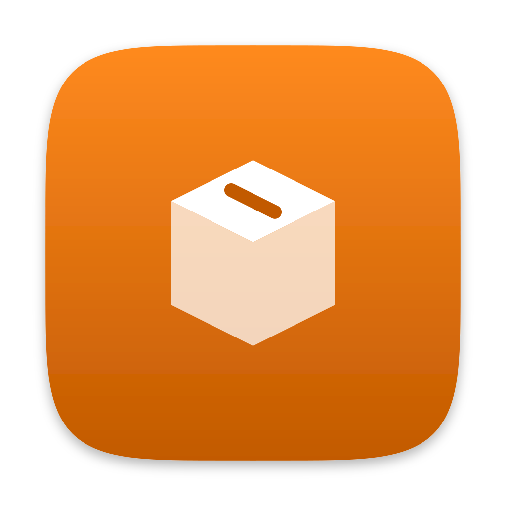

# dropcube

Dropbox, minus almost everything: a write-only file drop for agents on remote machines, with capability-URL viewing for you.

Agents run `dropcube upload <file>` and get back a private link to send you. The API token can upload, and keep or remove a file you also hold the link to. It can never read or list files, so a leaked token on a remote machine exposes nothing. View links are unguessable and expire server-side. A second, private deployment can also require your Cloudflare Access login before anything is shown.

Three parts:

- **`worker/`**: a Cloudflare Worker in front of an R2 bucket. Handles authenticated `PUT`s and `POST`s, and serves `GET`s to anyone with the link, or only to your Access login on a private deployment.
- **the `dropcube` CLI** (this repo's Go module): what agents invoke to upload.
- **an agent skill** (`skills/dropcube/SKILL.md`): tells Claude Code how and when to use the CLI.

## One-time backend setup

Requires a Cloudflare account (free tier is plenty: R2 has 10 GB storage free with zero egress fees, Workers 100k requests/day).

```sh
cd worker
bunx wrangler login
bunx wrangler r2 bucket create dropcube
bunx wrangler r2 bucket create dropcube-keep   # holds files you choose to keep
bunx wrangler deploy                      # prints https://dropcube.<you>.workers.dev
# Until the secret below is set, the worker refuses every request with 503.

# API token: generate, save for the machines, set as worker secret
openssl rand -hex 32                      # keep this value, it is DROPCUBE_TOKEN
bunx wrangler secret put API_TOKEN        # paste it when prompted

# Auto-delete uploads after 30 days. Keep this equal to RETENTION_DAYS in
# worker/src/index.js, which is what the worker tells browsers and what it
# answers once the deadline passes but before the deletion sweep runs. The
# rule goes on this bucket only: `dropcube keep` works by moving a file to
# dropcube-keep, which has no rule.
bunx wrangler r2 bucket lifecycle add dropcube expire-after-30d --expire-days 30
```

`wrangler.toml` sets `PUBLIC_LINKS`, so this deployment shows a file to anyone with its link. Without that setting the worker requires an Access login to view (see below) and refuses every request until Access is configured.

Optional: to serve from your own (sub)domain instead of workers.dev, add it in the Cloudflare dashboard under the worker's settings ("Domains and Routes"), then use it as the `endpoint`. Links inherit whatever domain the upload came through, so no other config changes.

## Private deployment (optional)

A second deployment can require a Cloudflare Access login to view files, for the ones that should stay yours even if a link gets out. Without a login, every request gets the same answer whether the link is real or not, so a link cannot even be confirmed. Uploading, keeping and removing take the API token as before.

```sh
cd worker
bunx wrangler r2 bucket create dropcube-private
bunx wrangler r2 bucket create dropcube-private-keep
bunx wrangler r2 bucket lifecycle add dropcube-private expire-after-30d --expire-days 30
bunx wrangler deploy --env private
bunx wrangler secret put API_TOKEN --env private   # the same token, or a new one
```

Then in the Cloudflare dashboard:

1. Add a custom domain to the `dropcube-private` worker ("Domains and Routes").
2. Under Zero Trust, Access, Applications, add a self-hosted application for that domain with the path `f/*`, and a policy that allows you. Cover only `/f/`: uploads, keep and remove authenticate with the API token and must stay outside Access.
3. Note the application's Audience (AUD) tag and your team domain (`<team>.cloudflareaccess.com`), and set both on the worker:

```sh
bunx wrangler secret put ACCESS_TEAM_DOMAIN --env private
bunx wrangler secret put ACCESS_AUD --env private
```

The worker refuses every request with 503 until both are set. It checks the signed login Access attaches to every view itself, rather than trusting that Access is in front, so a misconfigured or disabled Access application locks files away instead of exposing them.

To keep filenames out of private links as well (`/f/<id>` instead of `/f/<id>/<name>`), uncomment `ID_ONLY_LINKS` in `wrangler.toml` and redeploy. The name still comes back as the download name once you are logged in. This applies to new uploads only.

Point the CLI at it with a `private` section in the config (see [Configuration](#configuration)), then upload with `dropcube upload --private <file>`.

## Installing the CLI

```sh
curl -fsSL https://raw.githubusercontent.com/dittofleet/dropcube/main/install.sh | sh
```

Installs the latest release to `~/.local/bin/dropcube` (override with `DROPCUBE_INSTALL_DIR`) and sets up `~/.config/dropcube/config.json`. When a terminal is attached the installer prompts for your endpoint and token (press Enter to skip), and otherwise it creates a starter config for you to fill in.

**Provisioning a remote machine in one line**: pass the endpoint and token to the installer and it writes a ready-to-use config instead of the starter. The assignments go on the `sh` side of the pipe, because a prefix before `curl` would never reach the shell running the script:

```sh
curl -fsSL https://raw.githubusercontent.com/dittofleet/dropcube/main/install.sh \
  | DROPCUBE_ENDPOINT=https://dropcube.<you>.workers.dev \
    DROPCUBE_TOKEN=<API token> sh
```

Supported platforms: macOS (arm64, x64), Linux (arm64, x64).

## Usage

```sh
dropcube upload report.html    # prints one view link per file
dropcube upload --private x.pdf  # same, to the private deployment
dropcube keep <link>           # stop a file expiring, same link
dropcube remove <link>         # delete an upload early
```

Links print to stdout, one per file in argument order, pipe-friendly for agents. Anyone with a link (and, on a private deployment, your Access login) can view for 30 days, then the file is deleted and the link dies with it. Nobody can enumerate or guess links.

A link on its own only grants viewing that one file. Keeping and removing also take the token, so they go through the CLI, which sends each link's request to the configured deployment it came from.

A kept file has no deadline and no way to look it up other than the link you already have, so keep the link somewhere you will find it again. Nothing else can list your uploads.

## Agent skill

`skills/` holds an instruction snippet that teaches coding agents to
upload artifacts and hand you links whenever you ask for a file (or
produce one you should see from elsewhere). Install with
[Vercel skills](https://github.com/vercel-labs/skills) (skills.sh):

```sh
npx skills add https://github.com/dittofleet/dropcube
```

## Updating

`dropcube` checks once per day for new releases and prints a hint to stderr when an update is available.

Run `dropcube update` to upgrade.

The check is automatically skipped when:

- `CI` is set
- `DROPCUBE_NO_UPDATE_CHECK` is set
- stderr is not a TTY (piped or redirected)
- the binary was built locally (version is `dev`)

## Uninstalling

```sh
dropcube uninstall          # prompts for confirmation
dropcube uninstall --yes    # skip prompt
```

Removes the binary, `~/.config/dropcube/`, and `~/.local/share/dropcube/` (update cache). The Cloudflare worker, buckets, and uploaded files are not touched.

## Configuration

`~/.config/dropcube/config.json` (respects `$XDG_CONFIG_HOME`):

```json
{
  "schemaVersion": 1,
  "endpoint": "https://dropcube.<you>.workers.dev",
  "token": "<API token>"
}
```

For a private deployment, add a `private` section. Its `token` can be left out when both deployments share one.

```json
{
  "schemaVersion": 1,
  "endpoint": "https://dropcube.<you>.workers.dev",
  "token": "<API token>",
  "private": {
    "endpoint": "https://<your private domain>",
    "token": "<API token>"
  }
}
```

`DROPCUBE_ENDPOINT`, `DROPCUBE_TOKEN`, `DROPCUBE_PRIVATE_ENDPOINT` and `DROPCUBE_PRIVATE_TOKEN` env vars override the file.

## Development

Tests: `go test ./...` for the CLI, `cd worker && bun test` for the worker.
